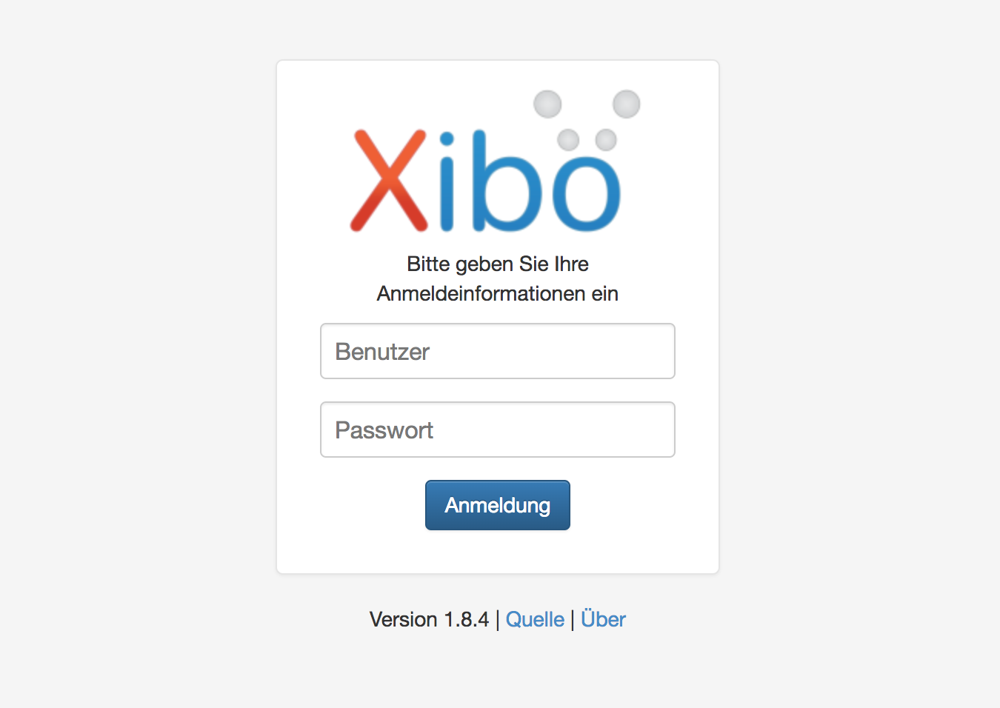
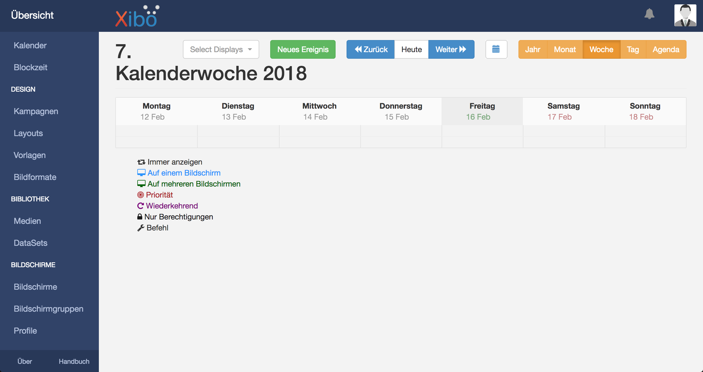
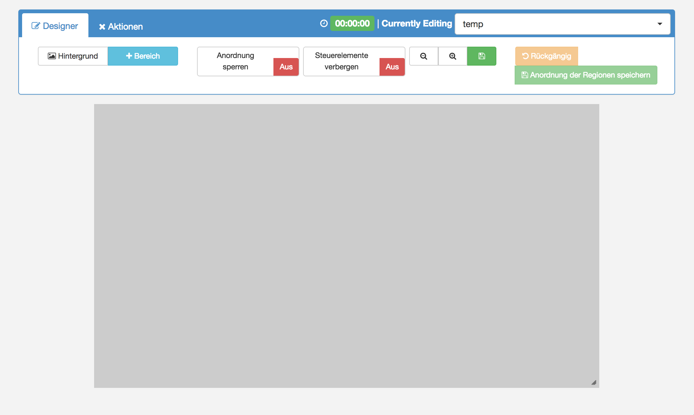

# Zum Signage Server verbinden Mac OSX/Unix

Um aus einem externen Netztwerk sich auf den Signage Server zu verbinden müssen wir uns zuerst zum internen Netztwerk des Servers tunneln.

Wir werden uns mithilfe von SSH in das interne Netzwerk tunneln.

<b>Mac OSX/Unix im den Terminal folgenden Befehl eingeben</b>

```
ssh <<IHR_USER>>@leotux.htl-leonding.ac.at -L 9090:172.18.199.120:80
```

Jetzt kann man unter <b>localhost:9090</b> auf den Server zugreifen und sich dort Einloggen.



Sie sollten dann zur Anmelde-Maske gelangen und Ihren Benutzer und das dazugehörige Passwort eingeben.

# Weboberfläche des XIBO
Das Steuerungszentrum des ganzen Signage System ist die Weboberfläche, die ganz einfach über einen Browser unter der Serveraddresse aufgerufen werden kann. Auf der Willkommensseite sind die wichtigsten Funktionen dargestellt:


* <b>Kalender</b><br>
Mit der Kalender Funktion kann eingetragen werden zu welchem Zeitpunkt, welcher Inhalt, auf welchem Bildschirm angezeigt werden soll. In dem Xibo-Kalender werden auch bereits eingetragene Aktivitäten angezeigt.



	
* <b>Layouts</b><br>
Die Layout-Funktion ist einer der wichtigsten Komponenten des Signage Systems. Es beschäftigt sich mit dem Designen der Inhalte. Auf diese Funktion kommen wir noch einmal zurück
	
* <b>Bibliothek</b><br>
Die Bibliothek-Funktion ist zuständig für das Verwalten der Medien. Hier können Sie verschiedene Dateien hochladen.  Diese Medien können dann in Layouts eingebunden und angezeigt werden.
	
* <b>Benutzer</b><br>
	Im Menüpunkt Benutzer können neue Benutzer angelegt werden und bereits bestehende bearbeitet oder gelöscht werden. Dabei gibt es auch ein Rechte-System. Es können auch Datenmengenbegrenzungen pro Benutzer eingestellt werden.
	
* <b>Einstellungen</b><br>
	Der Menüpunkt Einstellungen gibt dem Nutzer die Möglichkeit, verschiedene Optionen zu wählen. So sind zum Beispiel die richtige Zeitzone, E-Mail Benachrichtigungen, wichtige Einstellungen, die für ein einwandfreies Funktionieren des Xibo-Servers zuständig zuständig sind.
\end{enumerate}

## Designen mit XIBO
Beim Designen von einem neuen Layout im XIBO muss zuerst die Bildschirmauflösung ausgewählt und dem Layout ein passender Name zugewiesen werden, sowie optional auch eine Beschreibung. 

	

Dem Layout kann nun eine Region oder auch mehrere  hinzugefügt werden. Eine Region kann widerrum mehrere Widgets enthalten. Mit einem Doppelklick auf die Region kann ein Widget hinzugefügt werden. Es gibt viele verschiedene Arten von Widgets:

* <b>Bibliothek</b><br>
Mit diesem Widget können Dateien aus der Medienbibliothek in der Region angezeigt werden.
	
* <b>Uhr</b><br>
Dieser Widgettyp bindet eine Uhr in die Region ein. Es kann entweder eine Uhr im Analog Stil oder Digitalem Stil ausgewählt werden.
	
* <b>Bibliothek</b><br>
	Die Bibliothek Funktion ist zuständig für das Verwalten der Medien. Hier können Sie verschiedene Dateien hochladen.  Diese Medien können dann in Layouts eingebunden und angezeigt werden.

usw...


