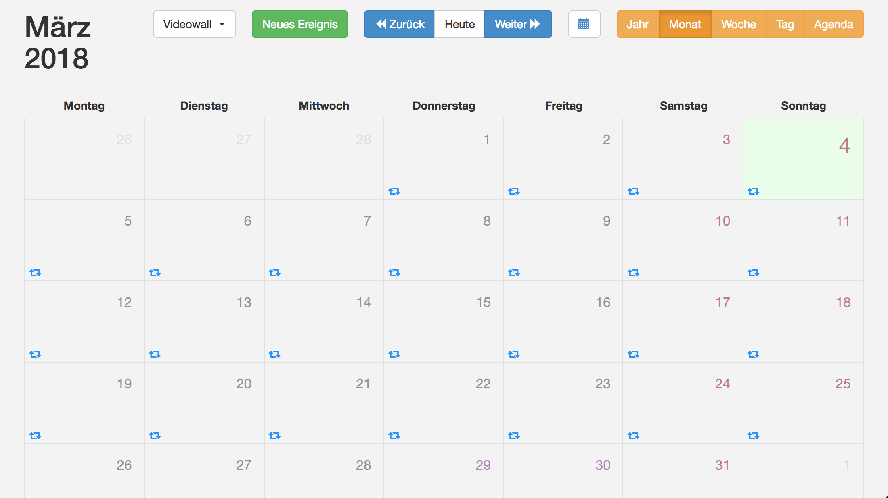
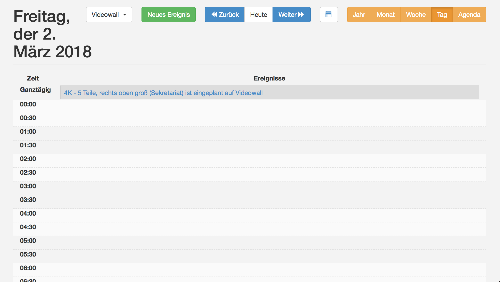
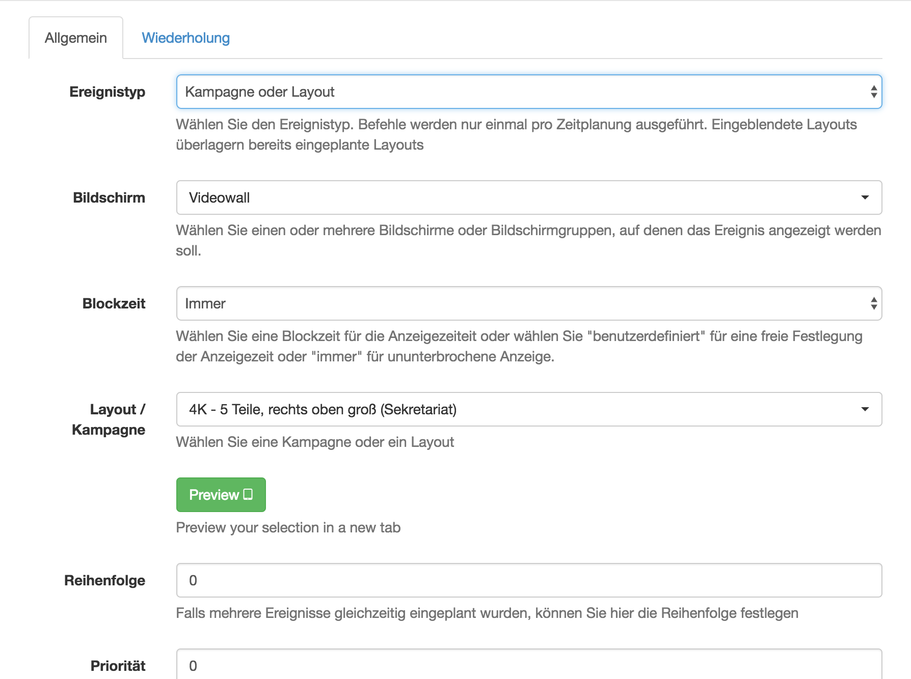

# How to change a Layout

## Per Hand im XIBO

### 1. Einzelne Layouts einem Display zuweisen

|API möglich|Dauer|Einplanen in Kalender|
|---|---|---
|Ja|Sofort|Ja|

Dies wird in der Funktion "Kalender" gemacht.

Und zwar befinden sich in der Tagesansicht die geplanten Events. Ein Event kann dabei eine Kampagne oder ein Layout sein.

 
Wenn wir das Event anklicken öffnet sich ein Dialog-Fenster mit den Einstellungen die vorgenommen werden können.
 

### 2. Kampagnen zuweisen

Beim zuweisen einer Kampagne wird es wie bei Nr.: 1 gemacht nur das wir kein einzelnes Layout zuweisen sondern eine zuvor erstellte Kampagne. 

|API möglich|Dauer|Einplanen in Kalender|
|---|---|---
|JA|Sofort|Ja|

### 3. Mithilfe vom Default Layout das gewünschte Layout abspielen

*** Funktioniert nur wenn dem Display kein Layout oder sonstiges zugewiesen hat

|API möglich|Dauer|Einplanen in Kalender|
|---|---|---
|Nein|Langsam|Nein|

