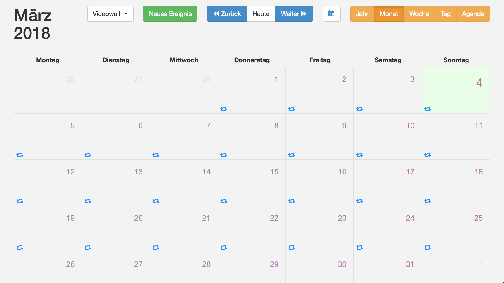
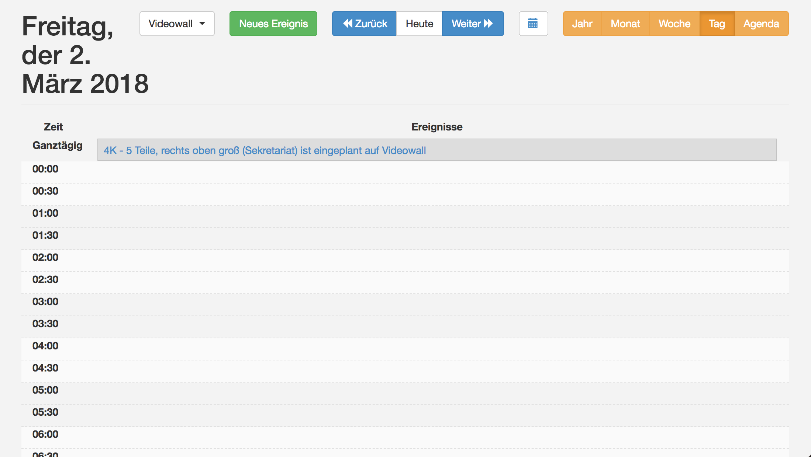
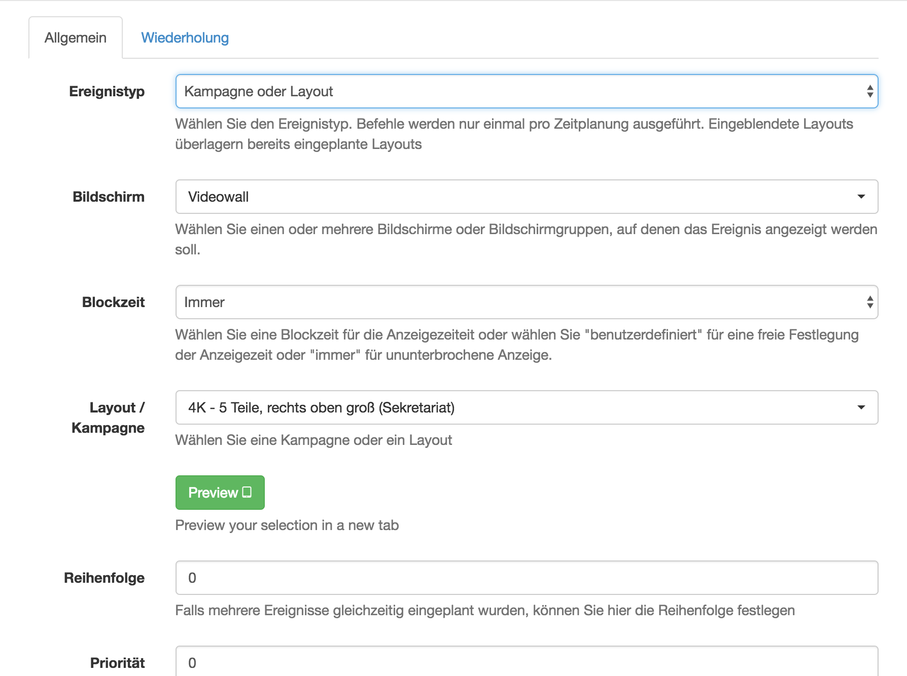
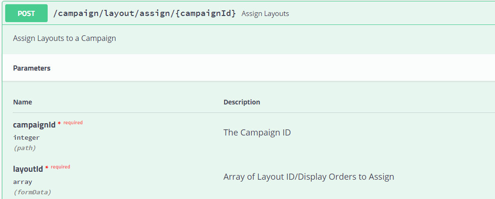
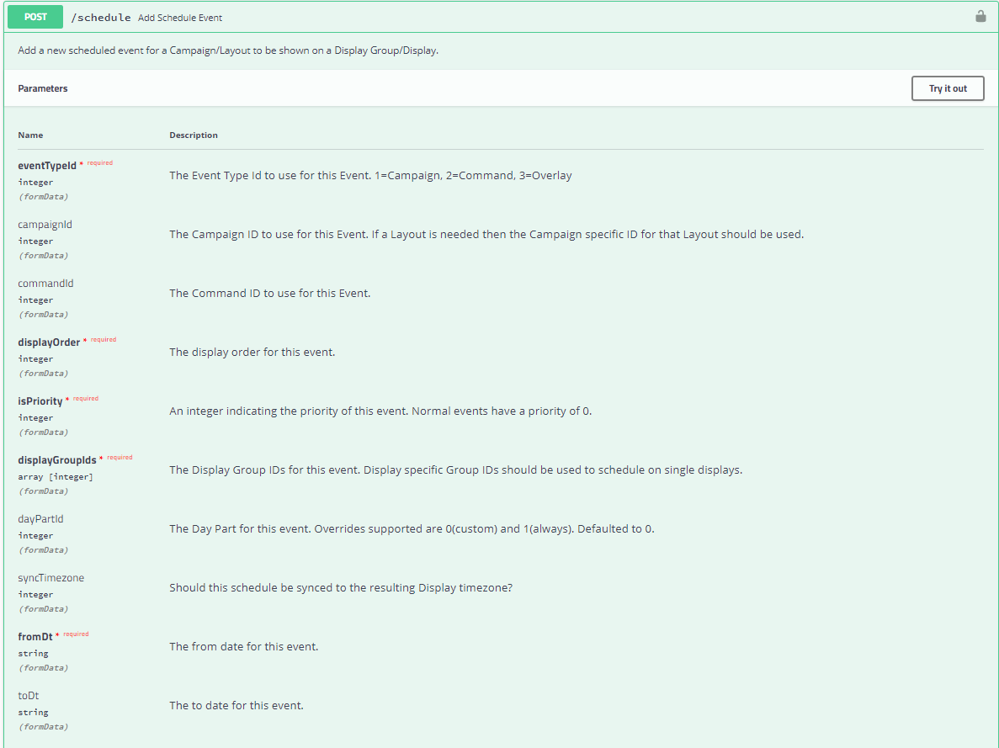

# How to change a Layout

##1. Einzelne Layouts einem Display zuweisen

|API möglich|Dauer|Einplanen in Kalender|
|---|---|---|
|Ja|Sofort|Ja|

### Zuweisen des Layouts über die Website des Servers

Dies wird in der Funktion "Kalender" gemacht.

Und zwar befinden sich in der Tagesansicht die geplanten Events. Ein Event kann dabei eine Kampagne oder ein Layout sein.

Wenn wir das Event anklicken öffnet sich ein Dialog-Fenster mit den Einstellungen, die vorgenommen werden können. Wird bereits ein Layout angezeigt und soll das neu erstellte Layout sofort angezeigt werden, so muss dem erstellten Layout eine höhere Priorität zugewiesen werden.

### Zuweisen eines Layouts über die API 

Der schnellste Weg ein Layout sofort oder in gewünschten Zeitabständen anzeigen zu können ist es, das Layout einer Kampagne zuzuweisen. 

Um dies zu tun muss ein POST Request durchgeführt werden, der als URL Parameter die Kampagnen ID benötigt und im Body die ID des Layouts enthält. 

## 2. Kampagnen zuweisen

|API möglich|Dauer|Einplanen in Kalender|
|---|---|---|
|JA|Sofort|Ja|

###Zuweisen von Kampagnen über die Website des Servers 

Fehlt das die kampagne dann auch gescheduled werden muss es reicht nicht nur einer kampagne zuzuweisen

Der Vorgang des Zuweisens einer Kampagne unterscheidet sich kaum davon, wie es bei Nr.: 1 gemacht wurde; Der einzige wesentliche Unterschied ist, dass wir kein einzelnes Layout zuweisen sondern eine zuvor erstellte Kampagne. 

### Anzeigen von Kampagnen über die API Schnittstelle 

Erstellen einer Kampagne erfolgt über einen POST Request der den Namen als einzigen Parameter benötigt. Als Response erhält man die erstellte Kampagne mit der ID die vergeben wurde.

Um Kampagnen anzuzeigen ist es, eben so wie über die Website, am besten dies mittels Kalender zu tun. Dazu muss diese einem Event zugewiesen werden. Erstellt wird ein Event über folgenden Request: 

- Bei der eventTypeID ist 1 einzutragen
- Bei campaignId wird die ID der gewünschten Kampagne übergeben.
- Im Feld displayOrder wird, falls sich zwei Events zeitlich überlappen, die Reihenfolge in welcher sie nacheinander Angezeigt werden übergeben. Null wird hier dann übergen wenn kein weiters Event zeitgleich stattfindet.
- Bei isPriority ist die Priorität der Events einzutragen. Soll ein Event in einem Zeitraum als einziges angezeigt werden muss die Priorität über der aller anderen Events in diesem Zeitraum sein.
- Bei displayGroupIds werden die ID's der verschiedenen Display Gruppen übergeben. Möchten einzelne  Displays gesteuert werden, sollten diese einer Display Gruppe nur für diesen einen Display zugewiesen werden.
- Bei fromDt  wird der Zeitpunkt übermittelt an dem das Event starten soll.
- Bei toDt ist der Zeitpunkt einzutragen an dem das Event enden soll.

## 3. Mithilfe vom Default Layout das gewünschte Layout abspielen

*** Funktioniert nur wenn dem Display kein Layout oder sonstiges zugewiesen wurde.

|API möglich|Dauer|Einplanen in Kalender|
|---|---|---|
|Nein|Langsam|Nein|

