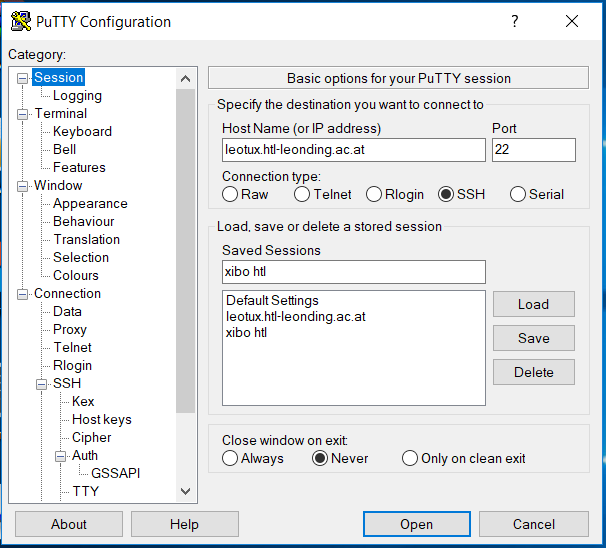
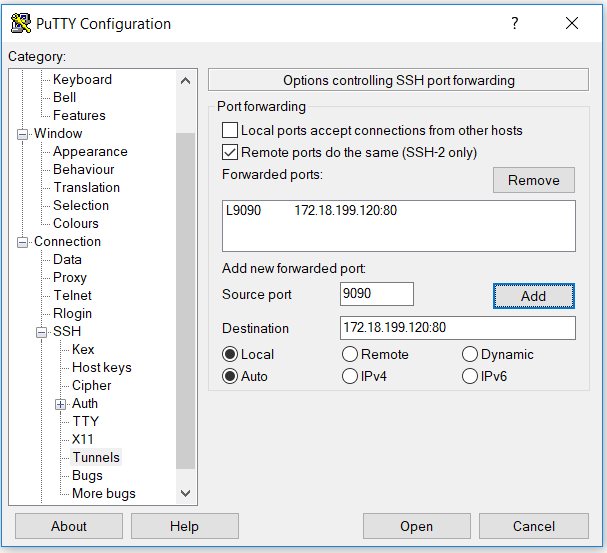

# Port Forward mit Putty auf Windows

Im Menüpunkt Session unter Hostname, Port und Connection type Daten wie folgt eintragen. Danach unter  Saved Session noch einen Namen zum speichern eintragen. Close Window on exit noch auf Never stellen.

Im Menüpunkt SSH unter Tunnels noch den zu forwardenden Port eintragen. Unter Source Port und Destionation wie in der Grafik eintragen Local und Auto auswählen und auf Add drücken (Remotes ports do the same auswählen nicht Vergessen / oben in der Grafik)

Danach wieder auf den Menüpunkt Session auf Save und danach auf Open. Anmeldedaten eingeben (moodle) und schon ist der Port geforwarded und unter localhost:9090 kann nun der XIBO-Server erreicht werden.