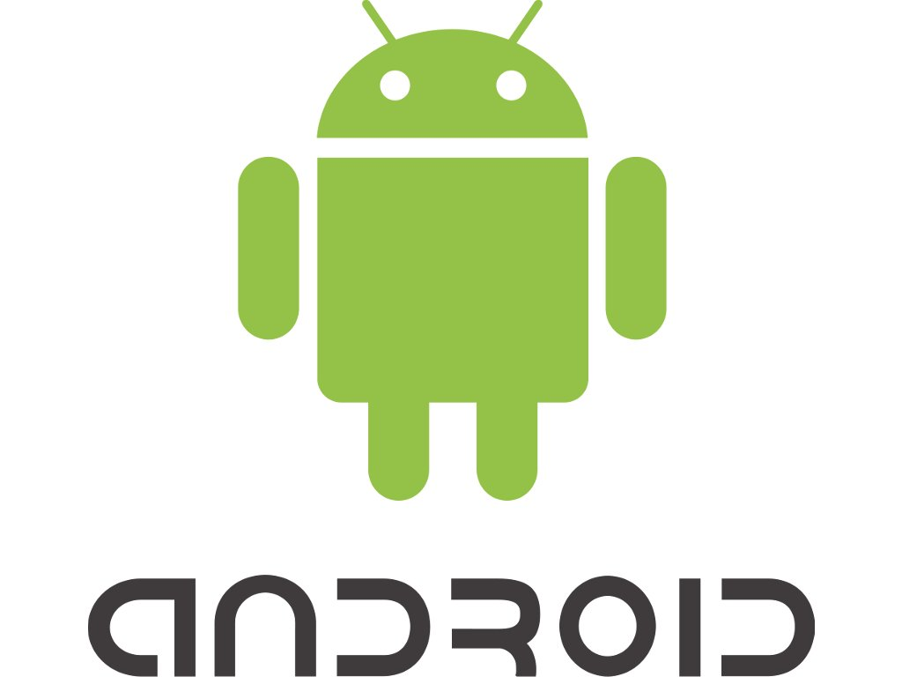

# HomeDS - Home DigitalSignage

This is our personal and customizable Digital Signage System. Our Project should help to easily and with a minimal effort create really beautiful Desktop Diashows.

The Layouts and Designs should be easily changed through our Android App and with our special remote control you can turn off/on all Devices. Displaying personal data like Wheater, Youtube Feeds, News Feed or whole Web Pages gets very easy and adaptive.

# Team

### Andrej Sakal(Team Leader)
Developer for Android, Java and Odroid programming

### Hofmann Felix
Developer for Android, Java and Odroid programming

## Swagger UI
**URL:** http://localhost:8080/homeds/swagger/swagger.html

# Our technologies

