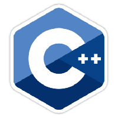

# HomeDS - Home DigitalSignage

This is our personal and customizable Digital Signage System. Our Project should help to easily and with a minimal effort create really beautiful Desktop Diashows.

The Layouts and Designs should be easily changed through various apps. 

Our Project also includes a remote control for all devices especially for TV's.

Displaying personal data like Weater, Youtube Feed, News Feed or whole Web Pages gets very easy and adaptive.

# Team

### Andrej Sakal(Team Leader)
Developer for Android, Java and Odroid programming

### Hofmann Felix
Developer for Android, Java and Odroid programming

# Our technologies

