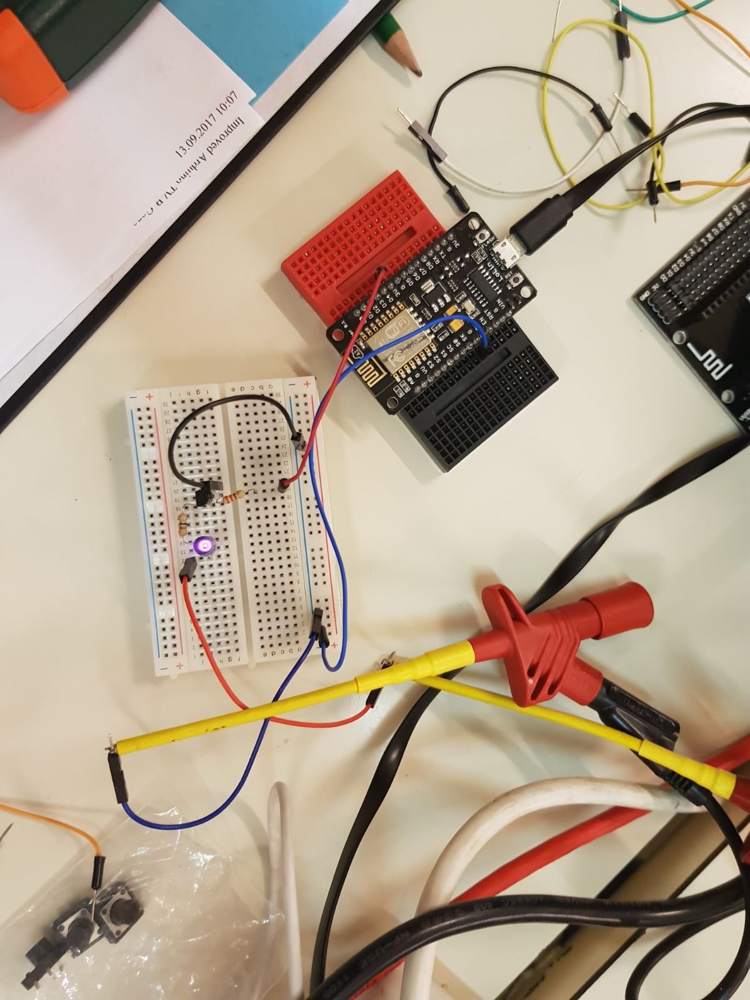
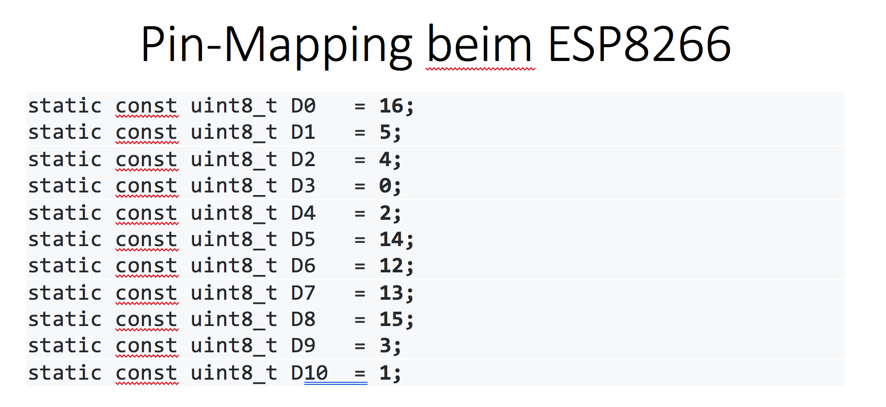
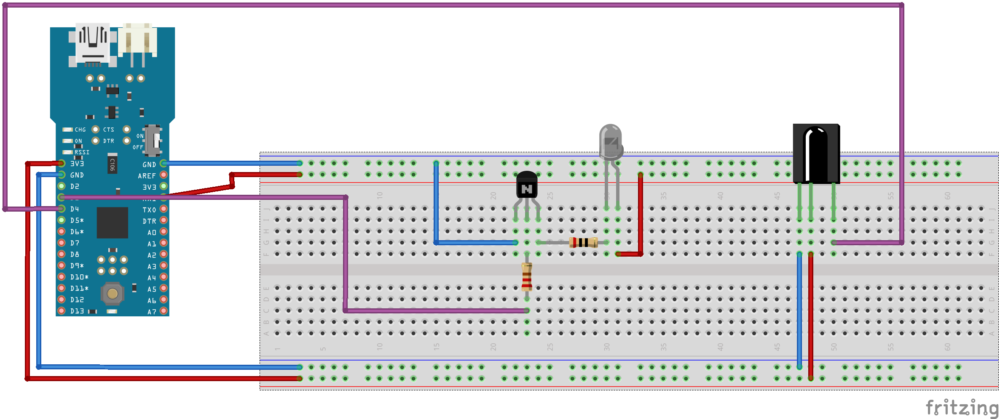
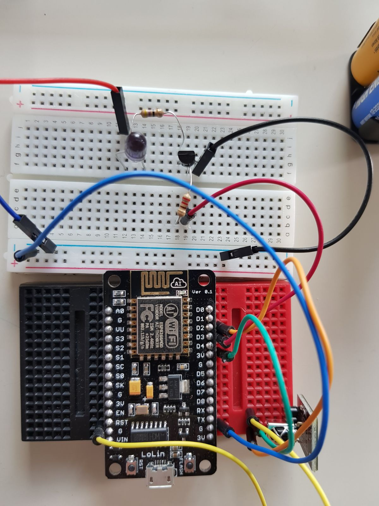

# Remote Control - SelfMade

Ziel/Aufgabenstellung
-

Es soll mithilfe einer selbstgemachten Fernbedienung möglich sein unseren Monitor welcher für das DigitalSignage System gebraucht wird ein und aus zu schalten.

Vorarbeit 
-
- Zuerst musste einmal ein Schaltplan für die Schaltung der Fernbedienung kreiert werden und nach vielem Recherchieren kamen wir auf eine Quelle:

	- [Schaltung Quelle](http://www.righto.com/2010/11/improved-arduino-tv-b-gone.html)

- Zuerst recherchierten wir welche Möglichkeiten zur Umsetzung unserer Idee es gibt. Nachdem wir bei einigen Blogs über das sogenannte TV-B-Gone Projekt gelesen haben fanden wir auch schon einen passenden Schaltplan. Aufgrund dessen haben wir dann den Schaltplan an unsere Anforderungen angepasst

	- Material:
		- 10 x Transistor 2N4401
		- 3 x IR SendLED (845nm, 930nm, 945nm)
		- 4er Batteriehalterung
		- 4 x 1,5 Volt Batterien
		- IR Empfänger (von Herr. Prof. Stütz)
		- ESP8266 inkl. Steckbrett, Widerstände und Stecker Kabel (von Herr Prof. Stütz)


- Zuerst fingen wir der Einfachheit halber nur mit dem IR Sender an. Das größte Problem dabei war die Dimensionierung der Widerstände und die Zuordnung der Ein- & Ausgänge am ESP8266. Dies erforderte einige Tage an tüffteln und rechnen von uns.

<center></center>

- Als die Schaltung fertig war fingen wir an uns Gedanken zu machen wie man solch ein Gerät programmiert. Zuerst richteten wir uns alle Umgebungen und SDK's ein. Wir programmierten mit dem Editor "Atom" und der Extension "PlatformIO"
	- Bei der Programmierung suchten wir dann nach der richtigen Library um IR-Codes also Infrarot Signale leicht zu steuern dabei fanden wir einige hilfreiche aber auch sehr fehlerhafte Bibliotheken. Doch am Ende fanden wir die IRRemoteExp8266 Library am saubersten programmiert und sehr gut Dokumentiert mit vielen Beispielen.
	- Doch wir hatten einige Probleme nämlich ist beim ESP8266 der Digital-PIN 4 nicht der echte PIN 4 im Programm sondern der PIN 2. Um dies zu Erfahren dauert es wieder einige Stunden.
	
	
	
	-  Nachdem wir endlich die Stolpersteine gelöst waren, war es an der Zeit den richtige Infrarot Code zu senden um unseren damals in Verwendung gewesenen LG-TV Ein und Aus zu schalten. Doch welchen IR-Code musste man Senden? Nach Tage langen suchen nach dem richtigen code entschieden wir uns unsere Schaltung einfach um ein IR-Code Lesegerät zu erweitern und die Codes einzulesen. Gesagt getan suchten wir Schaltungspläne im Internet und haben diesen auch sehr schnell umgesetzt.

- Auch nachdem Lösen dieses Problems fanden wir heraus das unser LG nicht auf dem Standard der LG's operiert sondern man den NEC-Standard verwenden muss




- Der fertige Code zum Ein- & Ausschalten des LG's:

```
uint16_t SEND_PIN = 2;

IRsend irsend(SEND_PIN);

void setup()
{
  Serial.println("Setup initiated ...");
  irsend.begin();
  Serial.begin(9600);
}

void loop() {
irsend.sendNEC(0x20df10ef, 32);
delay(5000);
Serial.print(".");
}
```