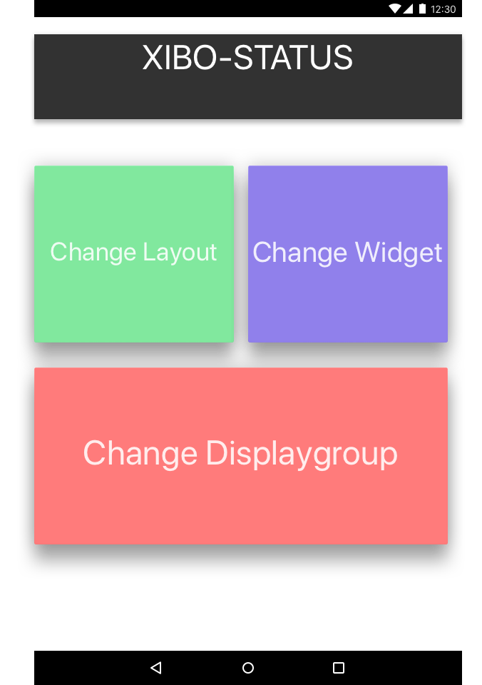

# XIBO - Android Application

Ziel/Aufgabenstellung
-

Mithilfe einer Mobilen Applikation soll es möglich sein in einem XIBOLayout entsprechend zu verändern

Umsetzung 
-

- Zuerst einmal mussten wird Layouts, Widgets, Playlists, Datasets und alle grundlegenden Elemente von XIBO kennenlernen!

		Realisierung dies machten wir indem wir uns die Dokus genau
		angesehen haben und im XIBO experiementierten


- Dann haben wir ein Beispiel Layout erstellt das alle Elemente enthält, Open/Close, eine Foto-Diashow, Ticker mit DataSet

- in der Swagger API Dokumentation haben wir uns dann nochmal in die Details geworfen und die verschiedenen Schnittstellen analysiert und daraus Lösungsvorgängen für unsere Problematik gesucht

	- [Swagger Doku](https://xibo.org.uk/manual-tempel/api/)

Implementierung
-  
  - Wir fingen dann mit einer einfachen Android Applikation an die nur die Uhrzeit von XIBO-Server abfragte. 
  	- Um aber mit dem XIBO zu kommunizieren muss man sich vorher mit OAuth2 Authentifizierenn
  	- diese Authentifikation sieht in Android so aus

``` 
String stringBody = "client_id=" + CLIENT_ID
                    + "&client_secret=" + CLIENT_SECRET
                    + "&grant_type=client_credentials";
            RequestBody body = RequestBody
            						 .create(MediaType.parse("application/x-www-form-urlencoded"), stringBody);

Request request = new Request.Builder()
        .url(AUTHORIZE_URL)
        .post(body)
        .addHeader("content-type", "application/x-www-form-urlencoded")
        .addHeader("cache-control", "no-cache")
        .build(); 
```
  	 	
  - Dann wollten wir einen Layout wechsel von einer DisplayGroup mithilfe eines POST-Requests machen. Da fingen aber schon einmal die ersten Problematiken an. 
  	- Es gibt kaum Dokumentationen darüber wie das gemacht wird
  	- die Swagger Dokumentation könnte auch präziser sein
  	- Fehlerhandling beim XIBO ist auch ungenau wenn oftmals überhaupt vorhanden
  
  			Unser Fehler war das wir die Parameter nicht im Body sondern als
  			QueryParams mitgeschickt haben diese wurden aber vom Server nicht 
  			angenommen. Es dauert sehr lange bis wir dies gelöst haben.
  
  - Alls alle gewünschte Requests dann funktioniert haben. Haben wir einen RequestHelper geschrieben der sich um alle API Funktionen kümmert
  - Dann ging es um das Designtechnische wir haben uns vorgenommen alles Einfach und Simple zu halten der Benutzer soll einfach und schnell seine gewünschten Sachen erledigen können
	- hier sind einige unserer ersten Skizzen zu unserem Design 
<br>
